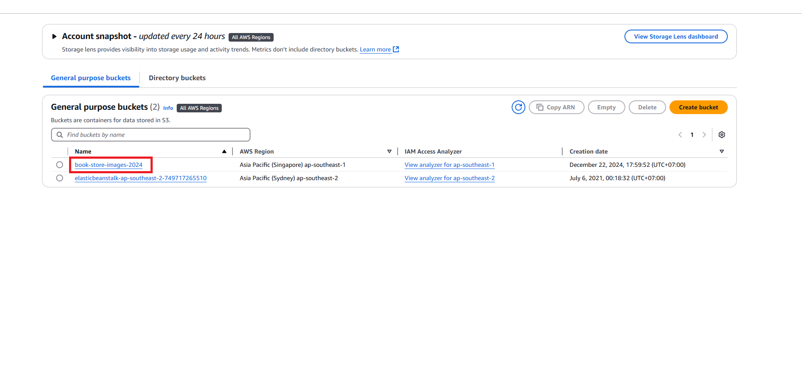
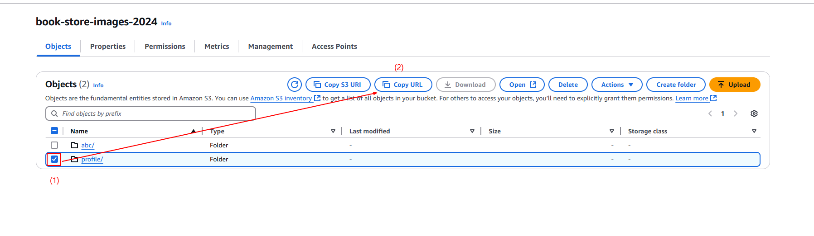
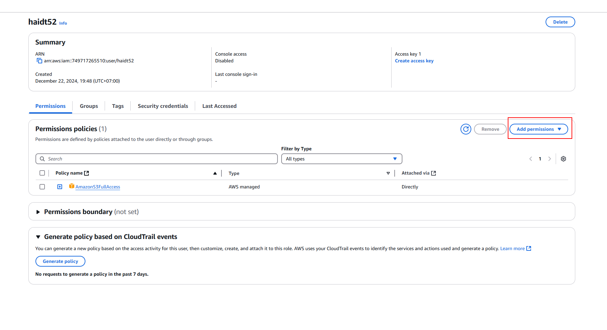
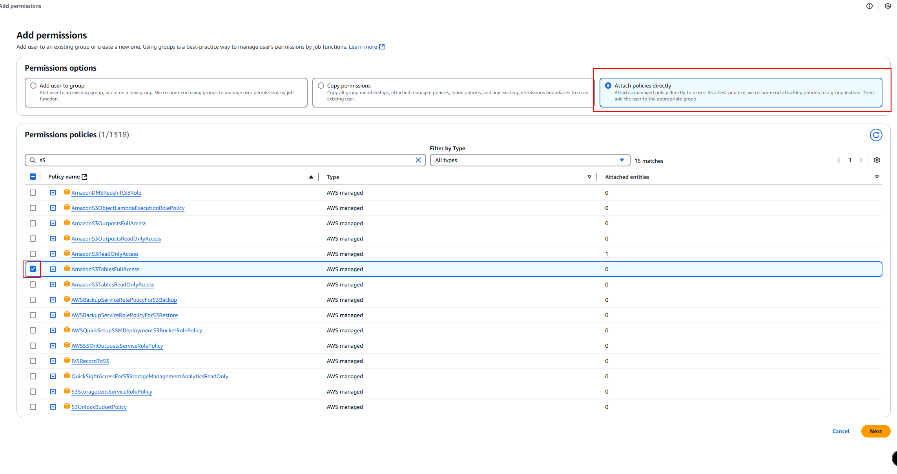
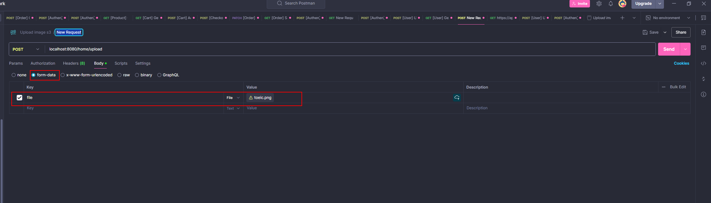

# Read me

## Hướng dẫn 

### 1. Cấu hình file `application.properties`

```commandline
spring.application.name=imageUploadS3
# lay bucketname trong s3
bucketName=XXX (1)
endpointUrl=XXXX (2)
aws.accessKey=XXXX (3)
aws.secretKey=XXXX (4)
region=XXXX(5)
```

Có 5 thông số cần phải cấu hình:

#### (1) bucketName 

- Vào AWS S3, tạo mới một bucket, sau đó copy name của bucket điền vào (1)



#### (2) endpointUrl

endpointUrl ~ url của object trong S3




#### (3) và (4) thông tin này không được push lên github

Vao IAM -> Users -> Tạo mới permission policy cho phép truy cập S3 full access -> sinh ra access Key va secretKey

- SecretKey chỉ sinh ra một lần mỗi khi tạo mới permission cho nên nhớ lưu lại thông tin này





#### (5) region của dịch vụ S3 đang được sử dụng


### 2. Test postman

Su dung postman -> post -> body (form-data) -> type: File -> request

